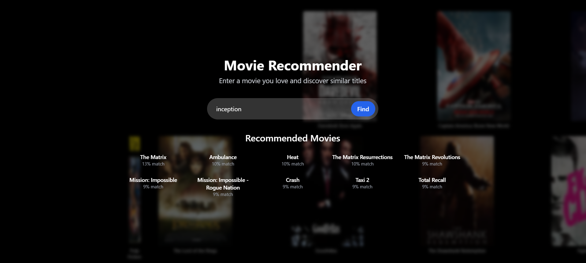

# Movie Recommendation System

A content-based movie recommendation system that suggests similar movies based on user input using cosine similarity.

## Overview

This project combines a Python/Flask backend with a React frontend to create a visually appealing and responsive movie recommendation app. The system analyzes movie features and calculates similarity scores to suggest movies that match the user's preferences.

## Features

- **Content-based Recommendations**: Uses cosine similarity to find movies with similar features
- **Responsive UI**: Dynamic search with autocomplete suggestions
- **Animated Background**: Moving movie posters create a cinematic experience
- **Memory-efficient Backend**: Optimized for handling large movie datasets

## Tech Stack

### Frontend
- React.js
- Tailwind CSS

### Backend
- Flask (Python)
- scikit-learn for TF-IDF vectorization and cosine similarity
- Pandas for data handling

## How It Works

1. **Data Processing**: The system processes movie data including titles, genres, and other relevant features.
2. **Feature Extraction**: TF-IDF vectorization converts text features into numerical vectors.
3. **Similarity Calculation**: Cosine similarity measures how similar movies are to each other.
4. **Recommendation Generation**: When a user enters a movie title, the system finds the most similar movies based on the pre-calculated similarity scores.

## Future Improvements

- Add user authentication for personalized recommendations
- Implement collaborative filtering for improved suggestions
- Integrate with external APIs for up-to-date movie data

## Acknowledgements

- Dataset - https://huggingface.co/datasets/wykonos/movies